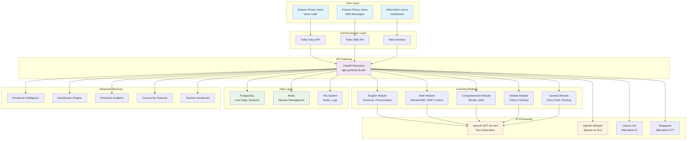
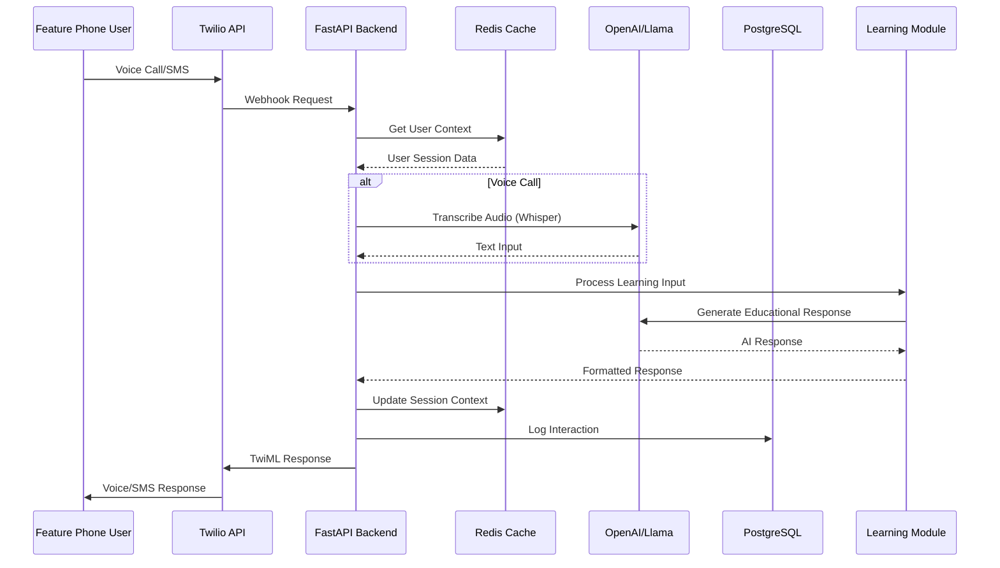
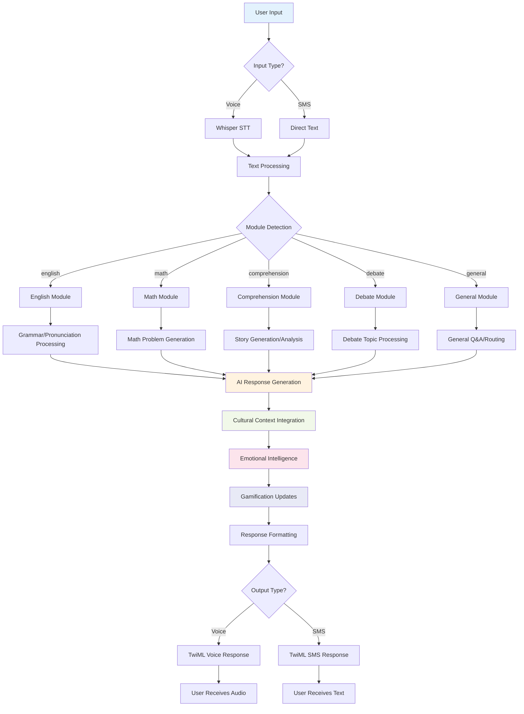
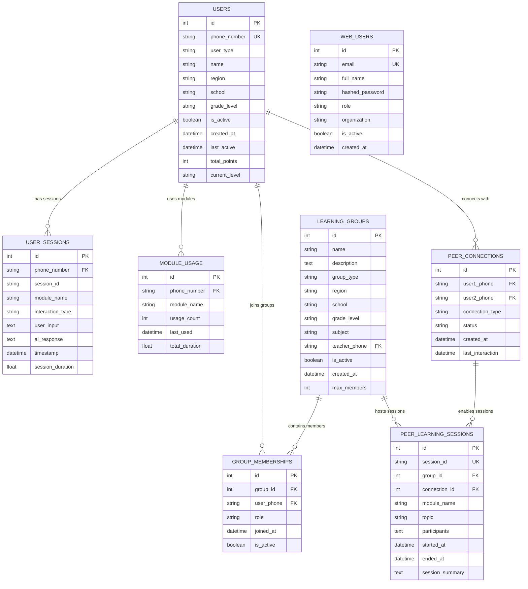
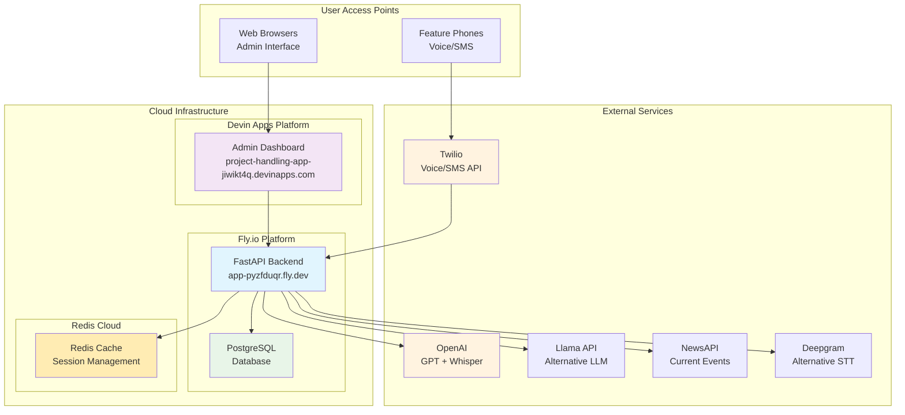
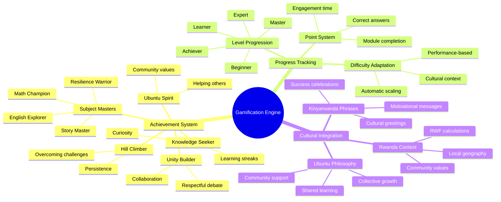
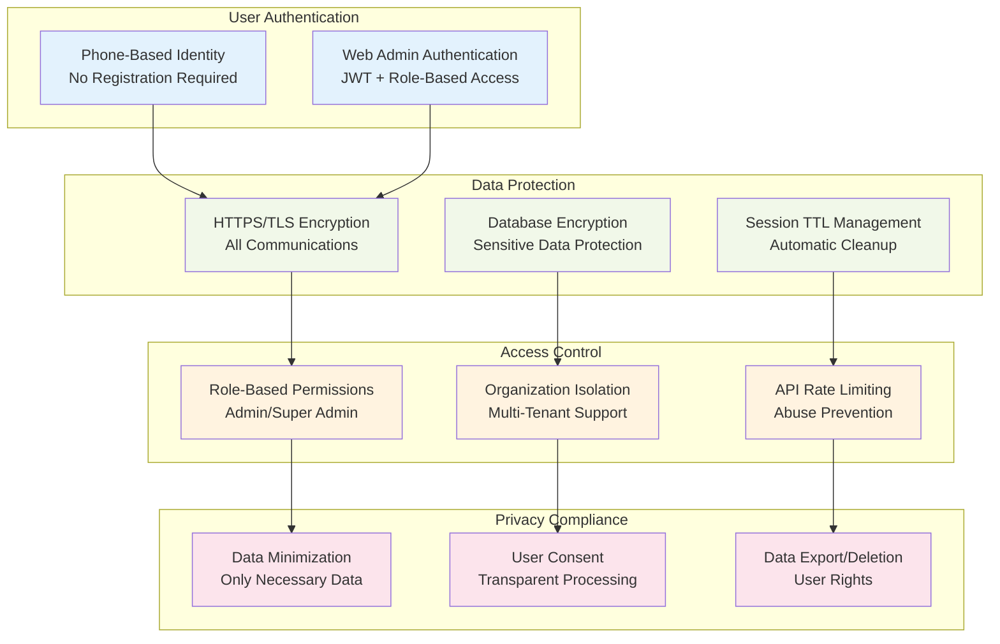
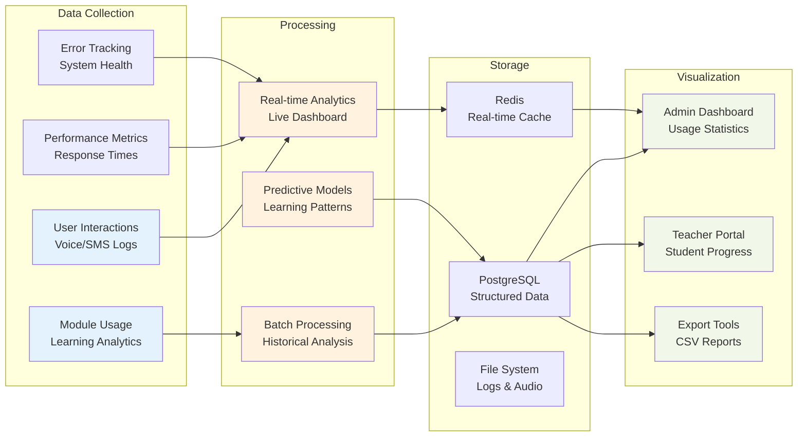

# BAKAME AI - Visual Architecture Diagrams

## 🏗️ System Architecture Diagram

## 🔄 Data Flow Architecture

## 🎓 Learning Module Flow

## 🧠 AI Processing Pipeline

```mermaid
graph LR
    subgraph "Input Processing"
        I1[Voice Input] --> STT[Speech-to-Text<br/>Whisper/Deepgram]
        I2[SMS Input] --> TXT[Text Input]
        STT --> TXT
    end
    
    subgraph "Context Management"
        TXT --> CTX[Context Retrieval<br/>Redis Session]
        CTX --> HIST[Conversation History]
        CTX --> STATE[User State]
    end
    
    subgraph "Module Processing"
        HIST --> MOD[Module Selection<br/>English/Math/etc.]
        STATE --> MOD
        MOD --> LOGIC[Module Logic<br/>Educational Processing]
    end
    
    subgraph "AI Generation"
        LOGIC --> PROMPT[Prompt Engineering<br/>Cultural Context]
        PROMPT --> LLM[LLM Processing<br/>GPT-4o-mini/Llama]
        LLM --> RESP[AI Response]
    end
    
    subgraph "Enhancement Services"
        RESP --> EMO[Emotional Intelligence<br/>Mood Detection]
        EMO --> GAM[Gamification<br/>Points/Achievements]
        GAM --> CULT[Cultural Adaptation<br/>Kinyarwanda Integration]
    end
    
    subgraph "Output Generation"
        CULT --> FMT[Response Formatting]
        FMT --> VOICE[TwiML Voice]
        FMT --> SMS[TwiML SMS]
    end
    
    style STT fill:#ffecb3
    style LLM fill:#ffecb3
    style EMO fill:#f8bbd9
    style GAM fill:#c8e6c9
    style CULT fill:#dcedc8
```

## 🏢 Database Schema Visualization

## 🌐 Deployment Architecture

## 🎮 Gamification System Architecture

## 🔒 Security Architecture

## 📊 Analytics & Monitoring Flow

---

**Diagram Version:** 1.0  
**Last Updated:** September 6, 2025  
**Status:** Complete Architecture Visualization  
**Tools:** Mermaid.js for dynamic diagrams
