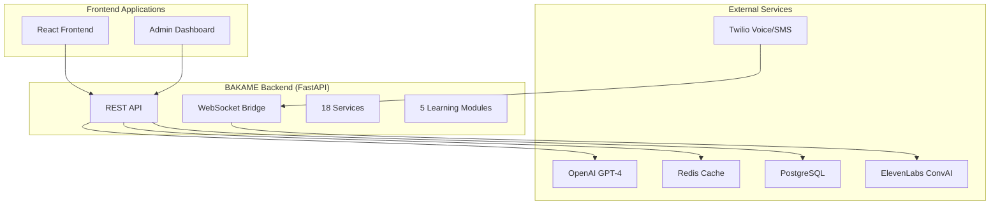
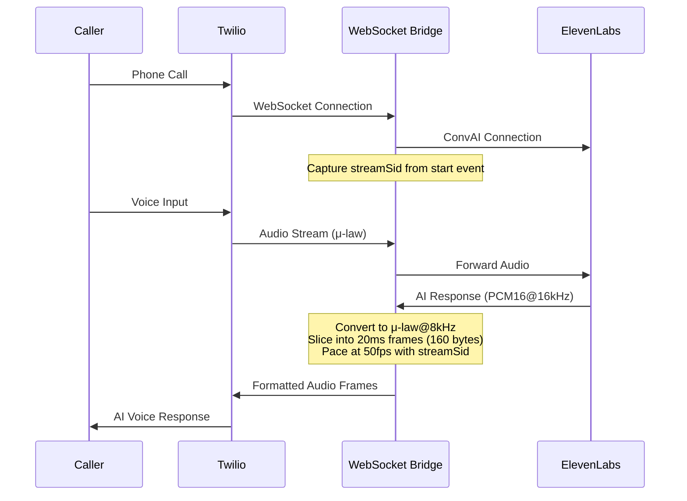

# BAKAME AI - Current Codebase Structure Documentation

## Overview

BAKAME AI is a comprehensive AI learning assistant platform designed for feature phones, accessible via voice and SMS. The system consists of three main components deployed across different environments:

- **Backend (FastAPI)**: Core API and audio processing engine
- **Frontend (React/Vite)**: User-facing web application
- **Admin (React/TypeScript)**: Administrative dashboard

## System Architecture Summary



## Enhanced Audio Processing Pipeline

The system features a sophisticated audio routing pipeline that ensures seamless voice interactions:



## Backend Architecture (bakame-backend)

### Core Application Structure

| Component | File | Purpose |
|-----------|------|---------|
| Main Application | `app/main.py` | FastAPI app with WebSocket bridge |
| Configuration | `app/config.py` | Environment and settings management |
| ElevenLabs Client | `app/elevenlabs_client.py` | WebSocket connection with auth fallback |
| Database Models | `app/models/` | SQLAlchemy models and database setup |

### Services Layer (18 Services)

| Service | File | Functionality |
|---------|------|---------------|
| OpenAI Service | `app/services/openai_service.py` | GPT-4 integration with cultural prompts |
| Twilio Service | `app/services/twilio_service.py` | Voice/SMS webhook handling |
| Redis Service | `app/services/redis_service.py` | Session and context management |
| ElevenLabs Service | `app/services/elevenlabs_service.py` | Voice synthesis integration |
| Logging Service | `app/services/logging_service.py` | Interaction tracking and analytics |
| Emotional Intelligence | `app/services/emotional_intelligence_service.py` | Sentiment analysis and adaptation |
| Gamification Service | `app/services/gamification_service.py` | Achievement and progress tracking |
| Multimodal Service | `app/services/multimodal_service.py` | Multi-format content processing |
| Offline Service | `app/services/offline_service.py` | Offline capability and caching |
| Deepgram Service | `app/services/deepgram_service.py` | Speech-to-text processing |
| LLaMA Service | `app/services/llama_service.py` | Alternative LLM integration |
| Audio Service | `app/services/audio_service.py` | Audio processing utilities |
| SMS Service | `app/services/sms_service.py` | SMS-specific handling |
| Voice Service | `app/services/voice_service.py` | Voice interaction management |
| Analytics Service | `app/services/analytics_service.py` | Usage analytics and reporting |
| Security Service | `app/services/security_service.py` | Authentication and authorization |
| Notification Service | `app/services/notification_service.py` | Alert and notification system |
| Content Service | `app/services/content_service.py` | Educational content management |

### Learning Modules (5 Modules)

| Module | File | Focus Area |
|--------|------|------------|
| English Module | `app/modules/english_module.py` | Grammar, pronunciation, conversation |
| Math Module | `app/modules/math_module.py` | Mathematical concepts with Rwandan context |
| Comprehension Module | `app/modules/comprehension_module.py` | Reading and storytelling |
| Debate Module | `app/modules/debate_module.py` | Critical thinking and discussion |
| General Module | `app/modules/general_module.py` | General knowledge and navigation |

### API Routers

| Router | File | Endpoints |
|--------|------|-----------|
| Webhooks | `app/routers/webhooks.py` | `/call`, `/sms`, `/voice/process`, `/health` |
| Authentication | `app/routers/auth.py` | User authentication and authorization |
| Admin | `app/routers/admin.py` | Administrative functions |
| Content | `app/routers/content.py` | Content management |

### Audio Processing Implementation

The enhanced audio processing pipeline implements strict Twilio compliance:

```python
# Key Audio Processing Functions
def pcm16_16k_to_mulaw8k_20ms_frames(pcm16k: bytes) -> List[bytes]:
    # Downsample 16kHz → 8kHz
    # Convert to μ-law encoding
    # Slice into 20ms frames (160 bytes each)

async def send_twilio_media_frames(ws, stream_sid: str, mulaw_frames: List[bytes]):
    # Send frames at 50fps (20ms intervals)
    # Include streamSid in every message
    # Maintain real-time pacing with asyncio.sleep(0.02)
```

### Dependencies (pyproject.toml)

| Category | Dependencies |
|----------|-------------|
| Web Framework | FastAPI, Uvicorn |
| Database | PostgreSQL, SQLAlchemy, Redis |
| AI/ML | OpenAI, Transformers |
| Audio/Voice | Twilio, WebSockets |
| Utilities | Pydantic, Python-dotenv, Requests |

## Frontend Architecture (bakame-frontend)

### Technology Stack

| Technology | Version | Purpose |
|------------|---------|---------|
| React | ^18.3.1 | Core UI framework |
| Vite | ^5.4.1 | Build tool and dev server |
| TypeScript | ^5.5.3 | Type safety |
| Tailwind CSS | ^3.4.11 | Styling framework |
| Radix UI | Various | Component library |

### Key Dependencies

| Package | Purpose |
|---------|---------|
| `@radix-ui/*` | Comprehensive UI component library |
| `@tanstack/react-query` | Data fetching and state management |
| `react-router-dom` | Client-side routing |
| `axios` | HTTP client for API calls |
| `recharts` | Data visualization |
| `@supabase/supabase-js` | Database integration |

### Component Structure (152+ Files)

| Category | Examples | Count |
|----------|----------|-------|
| Pages | `Index.tsx`, `About.tsx`, `LearningModules.tsx` | 20+ |
| Components | `EarlyAccessModal.tsx`, `TeamMemberCard.tsx` | 80+ |
| UI Components | `button.tsx`, `card.tsx`, `dialog.tsx` | 40+ |
| Hooks | `usePagination.ts`, `useIVRClient.ts` | 12+ |
| Utils | `RealtimeChat.ts`, `security.ts` | 8+ |

### Key Features

- **IVR Interface**: Interactive Voice Response system
- **Admin Dashboard**: User and content management
- **Learning Modules**: Educational content delivery
- **Real-time Audio**: WebSocket-based audio streaming
- **Government Solutions**: Specialized government interfaces
- **Enterprise Features**: Business-focused functionality

## Admin Architecture (bakame-admin)

### Technology Stack

| Technology | Version | Purpose |
|------------|---------|---------|
| React | ^18.3.1 | Core UI framework |
| TypeScript | ~5.6.2 | Type safety |
| Vite | ^6.0.1 | Build tool |
| Radix UI | Latest | Component library |

### Component Structure (51+ Files)

| Category | Purpose |
|----------|---------|
| UI Components | Complete Radix UI component set |
| Hooks | Custom React hooks for admin functionality |
| Utils | Administrative utilities and helpers |

### Key Dependencies

| Package | Purpose |
|---------|---------|
| `@radix-ui/*` | Complete UI component ecosystem |
| `react-hook-form` | Form management |
| `zod` | Schema validation |
| `date-fns` | Date manipulation |
| `recharts` | Analytics and reporting |

## Deployment Configuration

### Backend Deployment (Fly.io)

```toml
# fly.toml
app = "bakame-elevenlabs-mcp"
primary_region = "fra"

[http_service]
internal_port = 8000
force_https = true
auto_stop_machines = true
auto_start_machines = true
min_machines_running = 0

[vm]
cpu_kind = "shared"
cpus = 1
memory_mb = 512
```

### Environment Variables

| Variable | Purpose |
|----------|---------|
| `ELEVENLABS_AGENT_ID` | ElevenLabs ConvAI agent identifier |
| `ELEVENLABS_WS_SECRET` | Workspace secret for authentication |
| `ELEVENLABS_API_KEY` | Fallback API key |
| `OPENAI_API_KEY` | OpenAI GPT-4 access |
| `TWILIO_*` | Twilio service credentials |
| `DATABASE_URL` | PostgreSQL connection |
| `REDIS_URL` | Redis cache connection |

### Build Configuration

| Component | Build Command | Output |
|-----------|---------------|--------|
| Backend | `uvicorn app.main:app` | FastAPI server |
| Frontend | `vite build` | Static assets |
| Admin | `tsc -b && vite build` | TypeScript + static assets |

## File Structure Overview

```
mvp/
├── bakame-backend/           # FastAPI backend
│   ├── app/
│   │   ├── main.py          # Main application with WebSocket bridge
│   │   ├── config.py        # Configuration management
│   │   ├── elevenlabs_client.py  # ElevenLabs integration
│   │   ├── services/        # 18 service modules
│   │   ├── modules/         # 5 learning modules
│   │   ├── routers/         # API endpoints
│   │   └── models/          # Database models
│   ├── Dockerfile           # Container configuration
│   ├── fly.toml            # Fly.io deployment config
│   └── pyproject.toml      # Python dependencies
├── bakame-frontend/         # React frontend
│   ├── src/
│   │   ├── pages/          # 20+ page components
│   │   ├── components/     # 80+ UI components
│   │   ├── hooks/          # Custom React hooks
│   │   └── utils/          # Utility functions
│   ├── package.json        # Node.js dependencies
│   └── vite.config.ts      # Vite configuration
└── bakame-admin/           # Admin dashboard
    ├── src/
    │   ├── components/     # Admin UI components
    │   └── hooks/          # Admin-specific hooks
    ├── package.json        # Node.js dependencies
    └── vite.config.ts      # Vite configuration
```

## Integration Points

### Backend ↔ Frontend
- REST API endpoints for data exchange
- WebSocket connections for real-time features
- Authentication and session management

### Backend ↔ Admin
- Administrative API endpoints
- User and content management interfaces
- Analytics and monitoring dashboards

### External Service Integration
- **Twilio**: Voice/SMS webhook handling
- **ElevenLabs**: AI voice synthesis via WebSocket
- **OpenAI**: GPT-4 for intelligent responses
- **Redis**: Session and context caching
- **PostgreSQL**: Persistent data storage

## Audio Processing Technical Details

### Twilio Compliance Requirements
- **Codec**: G.711 μ-law
- **Sample Rate**: 8 kHz
- **Frame Size**: 20ms (160 samples, 160 bytes)
- **Frame Rate**: Exactly 50 frames per second
- **Message Format**: JSON with `streamSid` included

### Implementation Highlights
- Real-time audio conversion from PCM16@16kHz to μ-law@8kHz
- Precise 20ms frame slicing and pacing
- WebSocket state management with reconnection logic
- Buffering system for audio synchronization
- Comprehensive logging for debugging

## Production Deployment Status

| Component | Status | URL |
|-----------|--------|-----|
| Backend API | ✅ Live | https://bakame-elevenlabs-mcp.fly.dev/ |
| Frontend | ✅ Live | https://app-pyzfduqr.fly.dev/ |
| Admin Dashboard | ✅ Live | https://project-handling-app-jiwikt4q.devinapps.com/ |

## Development Workflow

1. **Backend Development**: FastAPI with hot reload
2. **Frontend Development**: Vite dev server with HMR
3. **Admin Development**: TypeScript compilation + Vite
4. **Testing**: Comprehensive test suites for all components
5. **Deployment**: Automated deployment via Fly.io and Devin Apps

This documentation reflects the current state of the BAKAME AI codebase as of September 2025, including all recent enhancements to the audio processing pipeline and WebSocket integration.
