# BAKAME AI - System Architecture Diagrams

## Overall System Architecture

```mermaid
graph TB
    subgraph "User Interfaces"
        P[📱 Phone Calls]
        S[📱 SMS Messages]
        W[🌐 Web Frontend]
        A[⚙️ Admin Dashboard]
    end
    
    subgraph "External Services"
        T[Twilio<br/>Voice/SMS Gateway]
        E[ElevenLabs<br/>ConvAI Engine]
        O[OpenAI<br/>GPT-4]
        R[Redis<br/>Cache Layer]
        DB[PostgreSQL<br/>Database]
    end
    
    subgraph "BAKAME Backend (FastAPI)"
        WS[WebSocket Bridge<br/>Audio Processing]
        API[REST API<br/>Core Services]
        
        subgraph "Services Layer"
            S1[OpenAI Service]
            S2[Twilio Service]
            S3[Redis Service]
            S4[ElevenLabs Service]
            S5[Logging Service]
            S6[Emotional Intelligence]
            S7[Gamification Service]
            S8[Multimodal Service]
            S9[Offline Service]
            S10[Deepgram Service]
            S11[LLaMA Service]
            S12[Audio Service]
            S13[SMS Service]
            S14[Voice Service]
            S15[Analytics Service]
            S16[Security Service]
            S17[Notification Service]
            S18[Content Service]
        end
        
        subgraph "Learning Modules"
            M1[English Module]
            M2[Math Module]
            M3[Comprehension Module]
            M4[Debate Module]
            M5[General Module]
        end
    end
    
    subgraph "Frontend Applications"
        F[React Frontend<br/>Vite + TypeScript]
        AD[Admin Dashboard<br/>React + TypeScript]
    end
    
    %% User Interface Connections
    P --> T
    S --> T
    
    %% External Service Connections
    T --> WS
    T --> API
    WS --> E
    API --> O
    API --> R
    API --> DB
    
    %% Frontend Connections
    W --> F
    A --> AD
    F --> API
    AD --> API
    
    %% Internal Service Connections
    API --> S1
    API --> S2
    API --> S3
    API --> S4
    API --> S5
    API --> S6
    API --> S7
    API --> S8
    API --> S9
    API --> S10
    API --> S11
    API --> S12
    API --> S13
    API --> S14
    API --> S15
    API --> S16
    API --> S17
    API --> S18
    
    %% Module Connections
    API --> M1
    API --> M2
    API --> M3
    API --> M4
    API --> M5
    
    %% Styling
    classDef userInterface fill:#e1f5fe
    classDef external fill:#f3e5f5
    classDef backend fill:#e8f5e8
    classDef frontend fill:#fff3e0
    
    class P,S,W,A userInterface
    class T,E,O,R,DB external
    class WS,API,S1,S2,S3,S4,S5,S6,S7,S8,S9,S10,S11,S12,S13,S14,S15,S16,S17,S18,M1,M2,M3,M4,M5 backend
    class F,AD frontend
```

## Enhanced Audio Processing Pipeline

```mermaid
sequenceDiagram
    participant C as 📞 Caller
    participant T as Twilio<br/>Gateway
    participant WS as WebSocket<br/>Bridge
    participant E as ElevenLabs<br/>ConvAI
    participant B as Audio<br/>Buffer
    
    Note over C,E: Call Initiation & Setup
    C->>T: Initiates Phone Call
    T->>WS: WebSocket Connection
    Note over WS: Capture connection details
    WS->>E: Establish ConvAI Connection
    Note over E: Agent authentication
    
    Note over C,E: Audio Stream Start
    T->>WS: {"event": "start", "streamSid": "..."}
    Note over WS: Capture streamSid for all outbound frames
    WS->>E: Send conversation start signal
    
    Note over C,E: Voice Input Processing
    C->>T: Voice Input (μ-law@8kHz)
    T->>WS: Audio Stream
    WS->>E: Forward Audio to ConvAI
    Note over E: AI processes voice input
    
    Note over C,E: AI Response Generation
    E->>WS: AI Response (PCM16@16kHz)
    Note over WS: Audio Processing Pipeline:
    Note over WS: 1. Convert PCM16@16k → μ-law@8k
    Note over WS: 2. Slice into 20ms frames (160 bytes)
    Note over WS: 3. Add streamSid to each frame
    Note over WS: 4. Buffer frames if needed
    
    loop For each 20ms frame
        WS->>B: Queue frame with streamSid
        B->>WS: Retrieve frame for sending
        WS->>T: {"event": "media", "streamSid": "...", "media": {"payload": "..."}}
        Note over WS: Wait 20ms (50fps pacing)
    end
    
    T->>C: AI Voice Response
    
    Note over C,E: Conversation Continues
    Note over WS: Maintain WebSocket connections
    Note over WS: Handle reconnections if needed
    
    Note over C,E: Call Termination
    C->>T: Hangs up
    T->>WS: {"event": "stop"}
    WS->>E: Close ConvAI connection
    Note over WS: Clean up resources
```

## Service Dependency Graph

## API Endpoint Flow

## Frontend Component Architecture

## Admin Dashboard Architecture

## Deployment Architecture

## Audio Processing State Machine

```mermaid
stateDiagram-v2
    [*] --> Idle
    
    Idle --> Connecting : Incoming Call
    Connecting --> Connected : WebSocket Established
    Connected --> StreamReady : streamSid Captured
    
    StreamReady --> Processing : Audio Received
    Processing --> Converting : PCM16@16k Input
    Converting --> Framing : μ-law@8k Output
    Framing --> Buffering : 20ms Frames (160 bytes)
    Buffering --> Sending : Frame Queue Ready
    Sending --> Pacing : Send to Twilio
    Pacing --> Processing : Wait 20ms (50fps)
    
    Processing --> Silence : No Audio Input
    Silence --> SilenceFrames : Generate Padding
    SilenceFrames --> Sending : Maintain Pipeline
    
    StreamReady --> Reconnecting : Connection Lost
    Processing --> Reconnecting : WebSocket Error
    Reconnecting --> Connected : Reconnection Success
    Reconnecting --> Failed : Max Retries Exceeded
    
    Sending --> Stopping : Call End Signal
    Stopping --> Cleanup : Flush Buffers
    Cleanup --> Idle : Resources Released
    
    Failed --> Cleanup : Error Handling
    
    note right of Converting
        Audio Conversion:
        - Downsample 16kHz → 8kHz
        - Convert PCM → μ-law
        - Maintain audio quality
    end note
    
    note right of Framing
        Frame Processing:
        - Slice into 20ms chunks
        - Exactly 160 bytes per frame
        - Include streamSid in metadata
    end note
    
    note right of Pacing
        Timing Control:
        - 50 frames per second
        - asyncio.sleep(0.02)
        - Real-time delivery
    end note
```

This comprehensive set of diagrams illustrates the complete BAKAME AI system architecture, from high-level component relationships to detailed audio processing workflows. Each diagram focuses on a specific aspect of the system while maintaining consistency with the overall architecture.
