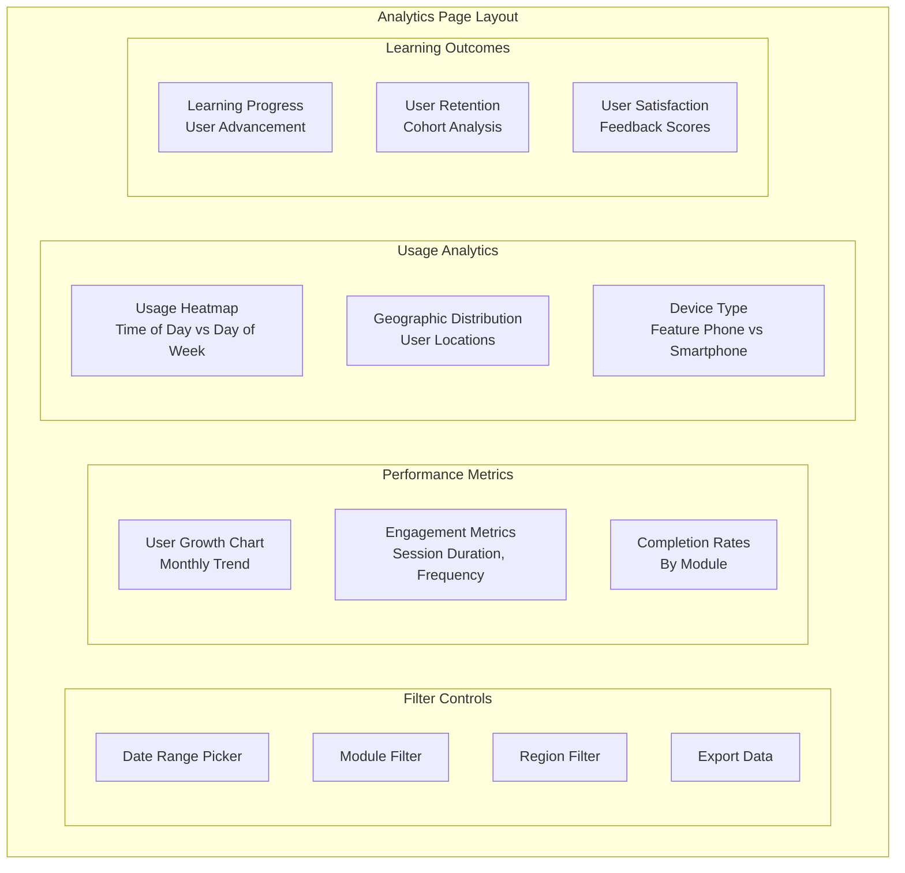
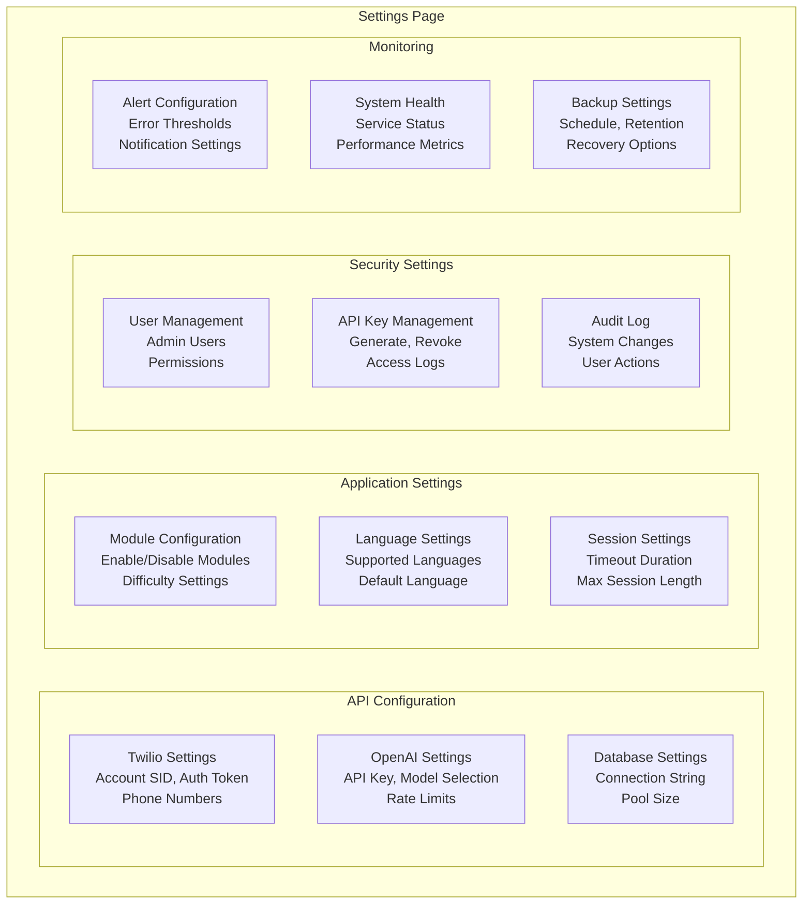
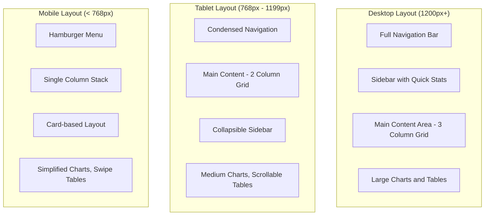
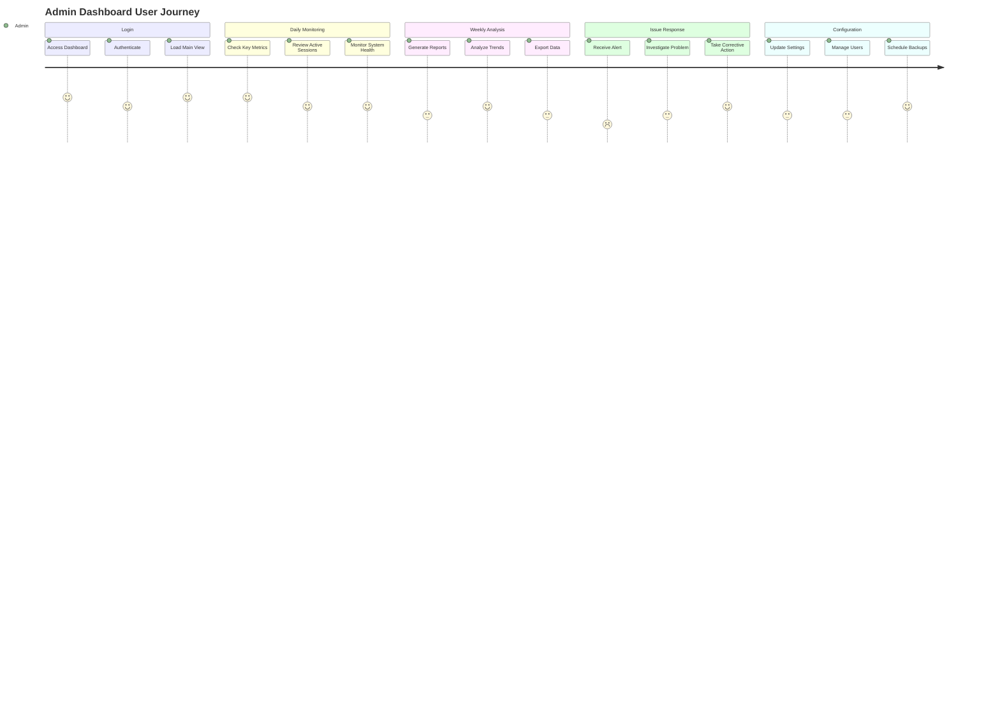

# BAKAME Admin Dashboard Wireframes

## Main Dashboard Layout

```mermaid
graph TB
    subgraph "Header Navigation"
        Logo[BAKAME Logo]
        Nav[Dashboard | Analytics | Sessions | Export | Settings]
        User[Admin User Profile]
    end
    
    subgraph "Main Content Area"
        subgraph "Key Metrics Row"
            Metric1[Active Users<br/>Today: 245]
            Metric2[Total Sessions<br/>This Week: 1,847]
            Metric3[Popular Module<br/>Math: 34%]
            Metric4[Avg Session<br/>Duration: 8.5m]
        end
        
        subgraph "Charts Section"
            Chart1[Daily Active Users<br/>Line Chart]
            Chart2[Module Usage<br/>Pie Chart]
        end
        
        subgraph "Recent Activity"
            Activity[Live Session Feed<br/>Real-time Updates]
        end
    end
    
    subgraph "Sidebar"
        QuickStats[Quick Stats<br/>Summary Cards]
        Alerts[System Alerts<br/>Notifications]
    end
```

## Analytics Dashboard Wireframe



## Session Management Interface

```mermaid
graph TB
    subgraph "Session Management Page"
        subgraph "Session List Controls"
            Search[Search Sessions<br/>Phone, Module, Date]
            Filter[Filter Options<br/>Active, Completed, Failed]
            Sort[Sort Options<br/>Time, Duration, Module]
        end
        
        subgraph "Session Table"
            Headers[Phone | Module | Type | Duration | Status | Actions]
            Row1[+1234567890 | Math | Voice | 12:34 | Active | View Details]
            Row2[+1234567891 | English | SMS | 08:45 | Completed | View Details]
            Row3[+1234567892 | Reading | Voice | 15:22 | Completed | View Details]
            Pagination[← Previous | 1 2 3 4 5 | Next →]
        end
        
        subgraph "Session Details Modal"
            SessionInfo[Session Information<br/>Start Time, End Time, Module]
            Conversation[Conversation History<br/>User Input → AI Response]
            Metadata[Session Metadata<br/>Device Info, Location, Performance]
        end
    end
```

## Data Export Interface

```mermaid
flowchart TD
    subgraph "Export Page Layout"
        subgraph "Export Configuration"
            DataType[Data Type Selection<br/>☑ User Sessions<br/>☑ Module Usage<br/>☐ System Logs]
            DateRange2[Date Range<br/>From: [Date Picker]<br/>To: [Date Picker]]
            Format[Export Format<br/>○ CSV ● Excel ○ JSON]
            Filters[Additional Filters<br/>Module, Region, User Type]
        end
        
        subgraph "Export Options"
            Schedule[Scheduled Exports<br/>Daily, Weekly, Monthly]
            Email[Email Delivery<br/>Send to: admin@bakame.org]
            Compression[Compression<br/>☑ ZIP Archive]
        end
        
        subgraph "Export History"
            Recent[Recent Exports<br/>Download Links & Status]
            Queue[Export Queue<br/>Pending Exports]
        end
        
        subgraph "Actions"
            Preview[Preview Data]
            Generate[Generate Export]
            Download[Download Ready Files]
        end
    end
```

## System Settings Interface



## Mobile Responsive Design



## User Experience Flow



## Component Library

### Dashboard Cards
```
┌─────────────────────────┐
│ Active Users            │
│ 245                     │
│ +12% from yesterday     │
└─────────────────────────┘
```

### Data Tables
```
┌─────────────┬──────────┬──────────┬─────────┐
│ Phone       │ Module   │ Duration │ Status  │
├─────────────┼──────────┼──────────┼─────────┤
│ +1234567890 │ Math     │ 12:34    │ Active  │
│ +1234567891 │ English  │ 08:45    │ Done    │
│ +1234567892 │ Reading  │ 15:22    │ Done    │
└─────────────┴──────────┴──────────┴─────────┘
```

### Chart Containers
```
┌─────────────────────────────────────────┐
│ Daily Active Users                      │
│ ┌─────────────────────────────────────┐ │
│ │     Line Chart Area                 │ │
│ │                                     │ │
│ │     Interactive Tooltips            │ │
│ │     Zoom & Pan Controls             │ │
│ └─────────────────────────────────────┘ │
│ Date Range: Last 30 Days               │
└─────────────────────────────────────────┘
```

### Modal Dialogs
```
┌─────────────────────────────────────────┐
│ Session Details                    ✕    │
├─────────────────────────────────────────┤
│ Phone: +1234567890                      │
│ Module: Math                            │
│ Duration: 12:34                         │
│ ─────────────────────────────────────── │
│ Conversation History:                   │
│ User: "Help me with fractions"          │
│ AI: "Let's start with basic fractions..." │
│ ─────────────────────────────────────── │
│ [Close] [Export Conversation]           │
└─────────────────────────────────────────┘
```
