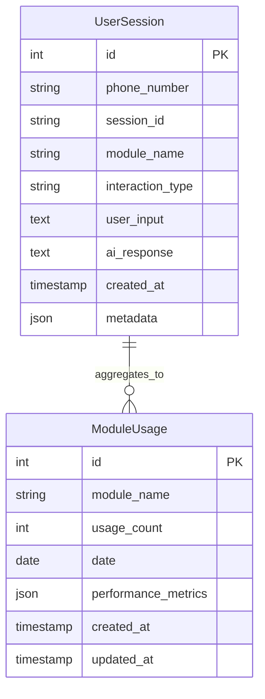
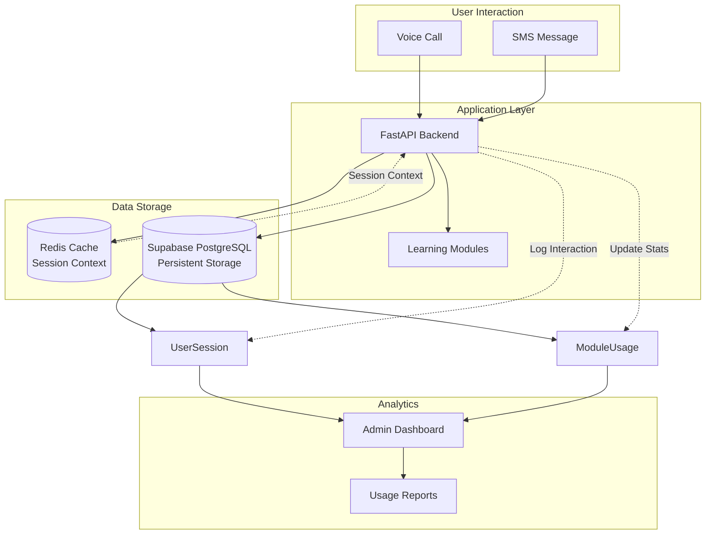
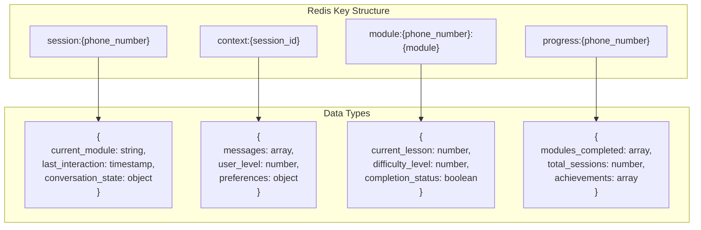
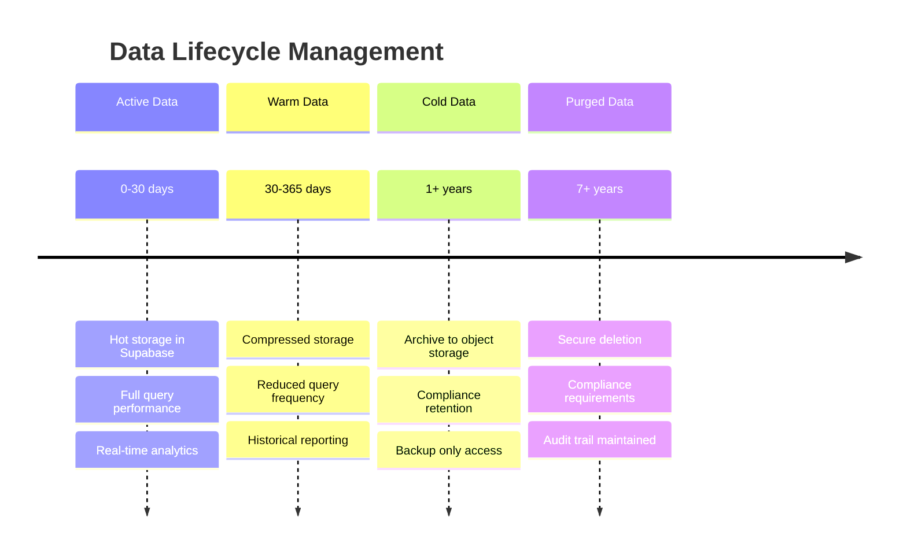

# BAKAME Database Schema Visualization

## Supabase PostgreSQL Schema



## Table Definitions

### UserSession Table
```sql
CREATE TABLE UserSession (
    id SERIAL PRIMARY KEY,
    phone_number VARCHAR(20) NOT NULL,
    session_id VARCHAR(100) NOT NULL,
    module_name VARCHAR(50) NOT NULL,
    interaction_type VARCHAR(20) NOT NULL, -- 'voice' or 'sms'
    user_input TEXT,
    ai_response TEXT,
    created_at TIMESTAMP DEFAULT CURRENT_TIMESTAMP,
    metadata JSONB
);

-- Indexes for performance
CREATE INDEX idx_user_session_phone ON UserSession(phone_number);
CREATE INDEX idx_user_session_module ON UserSession(module_name);
CREATE INDEX idx_user_session_created ON UserSession(created_at);
CREATE INDEX idx_user_session_session_id ON UserSession(session_id);
```

### ModuleUsage Table
```sql
CREATE TABLE ModuleUsage (
    id SERIAL PRIMARY KEY,
    module_name VARCHAR(50) NOT NULL,
    usage_count INTEGER DEFAULT 0,
    date DATE NOT NULL,
    performance_metrics JSONB,
    created_at TIMESTAMP DEFAULT CURRENT_TIMESTAMP,
    updated_at TIMESTAMP DEFAULT CURRENT_TIMESTAMP
);

-- Indexes for analytics
CREATE INDEX idx_module_usage_module ON ModuleUsage(module_name);
CREATE INDEX idx_module_usage_date ON ModuleUsage(date);
CREATE UNIQUE INDEX idx_module_usage_unique ON ModuleUsage(module_name, date);
```

## Data Flow Diagram



## Redis Cache Schema



## Analytics Query Patterns

### Common Analytics Queries

```sql
-- Daily active users
SELECT DATE(created_at) as date, 
       COUNT(DISTINCT phone_number) as active_users
FROM UserSession 
WHERE created_at >= CURRENT_DATE - INTERVAL '30 days'
GROUP BY DATE(created_at)
ORDER BY date;

-- Module popularity
SELECT module_name, 
       COUNT(*) as total_interactions,
       COUNT(DISTINCT phone_number) as unique_users
FROM UserSession 
WHERE created_at >= CURRENT_DATE - INTERVAL '7 days'
GROUP BY module_name
ORDER BY total_interactions DESC;

-- User engagement patterns
SELECT phone_number,
       COUNT(*) as session_count,
       COUNT(DISTINCT module_name) as modules_used,
       MAX(created_at) as last_activity
FROM UserSession 
GROUP BY phone_number
HAVING COUNT(*) > 1
ORDER BY session_count DESC;

-- Performance metrics by module
SELECT m.module_name,
       m.usage_count,
       m.performance_metrics->>'avg_session_duration' as avg_duration,
       m.performance_metrics->>'completion_rate' as completion_rate
FROM ModuleUsage m
WHERE m.date >= CURRENT_DATE - INTERVAL '7 days'
ORDER BY m.usage_count DESC;
```

## Data Retention and Archival



## Security and Privacy

### Data Encryption
- **At Rest**: AES-256 encryption in Supabase
- **In Transit**: TLS 1.3 for all connections
- **Application Level**: Sensitive fields encrypted before storage

### Access Control
- **Row Level Security**: Enabled on all tables
- **API Authentication**: JWT tokens for admin access
- **Database Roles**: Separate read/write permissions

### Privacy Compliance
- **Phone Number Hashing**: One-way hash for analytics
- **Data Minimization**: Only necessary fields stored
- **Right to Deletion**: Automated purge procedures
- **Audit Logging**: All data access tracked
