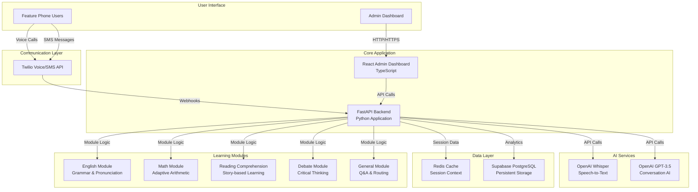
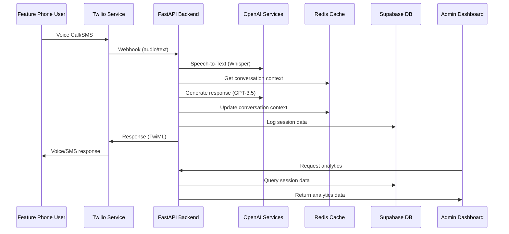

# BAKAME System Architecture

## High-Level System Architecture

## Data Flow Architecture

## Infrastructure Components

### Core Services
- **FastAPI Backend**: Python-based REST API handling all business logic
- **React Admin Dashboard**: TypeScript frontend for analytics and management
- **Twilio Integration**: Voice and SMS communication gateway
- **OpenAI Services**: AI-powered speech processing and conversation

### Data Storage
- **Redis Cache**: Real-time session context and conversation memory
- **Supabase PostgreSQL**: Persistent storage for user sessions and analytics

### Learning Modules
- **English Module**: Grammar correction and pronunciation practice
- **Math Module**: Progressive difficulty arithmetic with adaptive leveling
- **Comprehension Module**: Story-based reading comprehension
- **Debate Module**: Structured debates for critical thinking
- **General Module**: Module routing and general Q&A

### Deployment Infrastructure
- **Backend Hosting**: Fly.io cloud deployment
- **Frontend Hosting**: Static site deployment
- **Database**: Supabase managed PostgreSQL
- **Cache**: Redis cloud service
