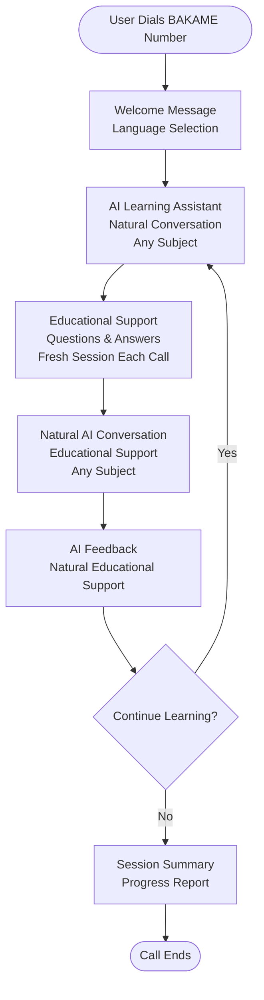
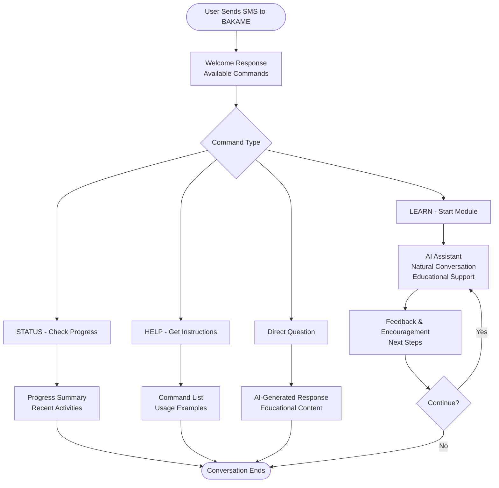
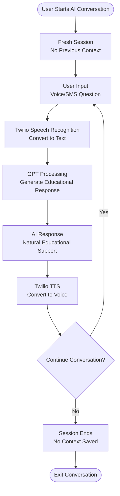

# BAKAME User Flow Diagrams

## Voice Call Learning Flow

```mermaid
flowchart TD
    Start([User Dials BAKAME Number]) --> Welcome[Welcome Message<br/>Language Selection]
    Welcome --> AIAssistant[AI Learning Assistant<br/>Natural Conversation<br/>Any Subject]
    
    AIAssistant --> Learning[Educational Support<br/>Questions & Answers<br/>Fresh Session Each Call]
    Learning --> ConversationFlow[Natural AI Conversation<br/>Educational Support<br/>Any Subject]
    
    ConversationFlow --> Feedback[AI Feedback<br/>Natural Educational Support]
    
    Feedback --> Continue{Continue Learning?}
    Continue -->|Yes| AIAssistant
    Continue -->|No| Summary[Session Summary<br/>Progress Report]
    Summary --> End([Call Ends])
```

## SMS Learning Flow

```mermaid
flowchart TD
    SMSStart([User Sends SMS to BAKAME]) --> SMSWelcome[Welcome Response<br/>Available Commands]
    SMSWelcome --> SMSCommand{Command Type}
    
    SMSCommand --> Learn[LEARN - Start Module]
    SMSCommand --> Status[STATUS - Check Progress]
    SMSCommand --> Help[HELP - Get Instructions]
    SMSCommand --> Question[Direct Question]
    
    Learn --> SMSLearning[AI Assistant<br/>Natural Conversation<br/>Educational Support]
    
    Status --> SMSProgress[Progress Summary<br/>Recent Activities]
    Help --> SMSInstructions[Command List<br/>Usage Examples]
    Question --> SMSAnswer[AI-Generated Response<br/>Educational Content]
    
    SMSLearning --> SMSFeedback[Feedback & Encouragement<br/>Next Steps]
    SMSProgress --> SMSEnd([Conversation Ends])
    SMSInstructions --> SMSEnd
    SMSAnswer --> SMSEnd
    SMSFeedback --> SMSContinue{Continue?}
    SMSContinue -->|Yes| SMSLearning
    SMSContinue -->|No| SMSEnd
```

## Admin Dashboard User Flow

```mermaid
flowchart TD
    AdminStart([Admin Accesses Dashboard]) --> Login[Authentication<br/>Admin Credentials]
    Login --> Dashboard[Main Dashboard<br/>Overview Analytics]
    
    Dashboard --> Analytics{Analytics Section}
    Dashboard --> Sessions{Session Management}
    Dashboard --> Export{Data Export}
    Dashboard --> Settings{System Settings}
    
    Analytics --> UserStats[User Statistics<br/>Active Users, Sessions]
    Analytics --> ModuleStats[Module Usage<br/>Popularity, Completion]
    Analytics --> Performance[Performance Metrics<br/>Response Times, Errors]
    
    Sessions --> ActiveSessions[Real-time Sessions<br/>Current User Activities]
    Sessions --> SessionHistory[Historical Sessions<br/>User Journey Analysis]
    
    Export --> CSVExport[CSV Data Export<br/>Custom Date Ranges]
    Export --> Reports[Automated Reports<br/>Weekly/Monthly Summaries]
    
    Settings --> SystemConfig[System Configuration<br/>API Keys, Endpoints]
    Settings --> UserManagement[User Management<br/>Access Controls]
    
    UserStats --> Dashboard
    ModuleStats --> Dashboard
    Performance --> Dashboard
    ActiveSessions --> Dashboard
    SessionHistory --> Dashboard
    CSVExport --> Dashboard
    Reports --> Dashboard
    SystemConfig --> Dashboard
    UserManagement --> Dashboard
```

## AI Learning Interaction Flow

```mermaid
flowchart TD
    AIEntry([User Starts AI Conversation]) --> FreshSession[Fresh Session<br/>No Previous Context]
    FreshSession --> UserInput[User Input<br/>Voice/SMS Question]
    
    UserInput --> SpeechRecognition[Twilio Speech Recognition<br/>Convert to Text]
    SpeechRecognition --> GPTProcessing[GPT Processing<br/>Generate Educational Response]
    
    GPTProcessing --> Response[AI Response<br/>Natural Educational Support]
    Response --> TTS[Twilio TTS<br/>Convert to Voice]
    
    TTS --> Continue{Continue Conversation?}
    Continue -->|Yes| UserInput
    Continue -->|No| SessionEnd[Session Ends<br/>No Context Saved]
    SessionEnd --> AIExit([Exit Conversation])
```
