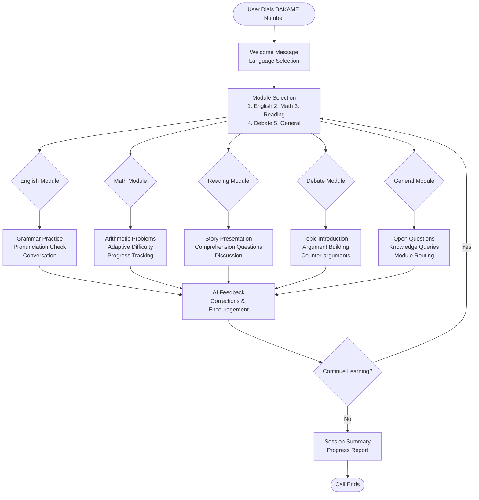
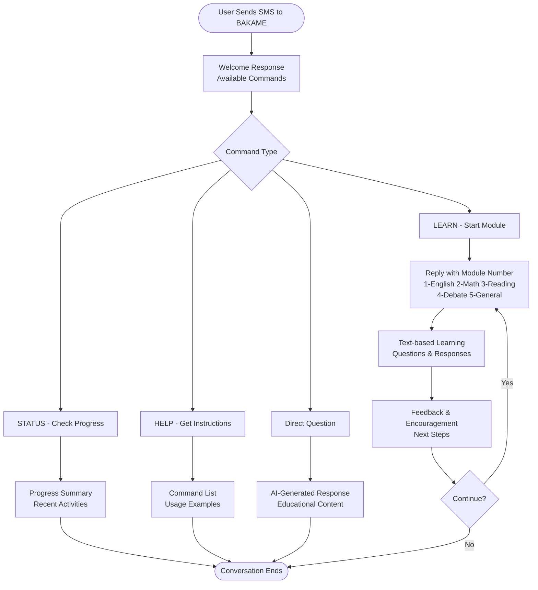
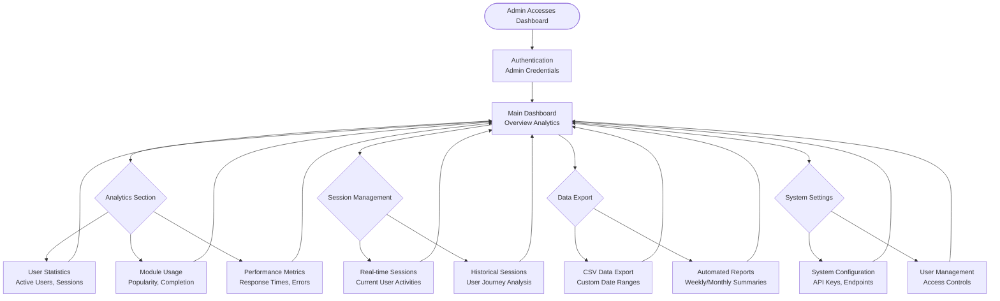
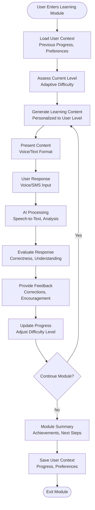

# BAKAME User Flow Diagrams

## Voice Call Learning Flow

```mermaid
flowchart TD
    Start([User Dials BAKAME Number]) --> Welcome[Welcome Message<br/>Language Selection]
    Welcome --> ModuleSelect[Module Selection<br/>1. English 2. Math 3. Reading<br/>4. Debate 5. General]
    
    ModuleSelect --> English{English Module}
    ModuleSelect --> Math{Math Module}
    ModuleSelect --> Reading{Reading Module}
    ModuleSelect --> Debate{Debate Module}
    ModuleSelect --> General{General Module}
    
    English --> EnglishFlow[Grammar Practice<br/>Pronunciation Check<br/>Conversation]
    Math --> MathFlow[Arithmetic Problems<br/>Adaptive Difficulty<br/>Progress Tracking]
    Reading --> ReadingFlow[Story Presentation<br/>Comprehension Questions<br/>Discussion]
    Debate --> DebateFlow[Topic Introduction<br/>Argument Building<br/>Counter-arguments]
    General --> GeneralFlow[Open Questions<br/>Knowledge Queries<br/>Module Routing]
    
    EnglishFlow --> Feedback[AI Feedback<br/>Corrections & Encouragement]
    MathFlow --> Feedback
    ReadingFlow --> Feedback
    DebateFlow --> Feedback
    GeneralFlow --> Feedback
    
    Feedback --> Continue{Continue Learning?}
    Continue -->|Yes| ModuleSelect
    Continue -->|No| Summary[Session Summary<br/>Progress Report]
    Summary --> End([Call Ends])
```

## SMS Learning Flow

```mermaid
flowchart TD
    SMSStart([User Sends SMS to BAKAME]) --> SMSWelcome[Welcome Response<br/>Available Commands]
    SMSWelcome --> SMSCommand{Command Type}
    
    SMSCommand --> Learn[LEARN - Start Module]
    SMSCommand --> Status[STATUS - Check Progress]
    SMSCommand --> Help[HELP - Get Instructions]
    SMSCommand --> Question[Direct Question]
    
    Learn --> SMSModuleSelect[Reply with Module Number<br/>1-English 2-Math 3-Reading<br/>4-Debate 5-General]
    SMSModuleSelect --> SMSLearning[Text-based Learning<br/>Questions & Responses]
    
    Status --> SMSProgress[Progress Summary<br/>Recent Activities]
    Help --> SMSInstructions[Command List<br/>Usage Examples]
    Question --> SMSAnswer[AI-Generated Response<br/>Educational Content]
    
    SMSLearning --> SMSFeedback[Feedback & Encouragement<br/>Next Steps]
    SMSProgress --> SMSEnd([Conversation Ends])
    SMSInstructions --> SMSEnd
    SMSAnswer --> SMSEnd
    SMSFeedback --> SMSContinue{Continue?}
    SMSContinue -->|Yes| SMSModuleSelect
    SMSContinue -->|No| SMSEnd
```

## Admin Dashboard User Flow

```mermaid
flowchart TD
    AdminStart([Admin Accesses Dashboard]) --> Login[Authentication<br/>Admin Credentials]
    Login --> Dashboard[Main Dashboard<br/>Overview Analytics]
    
    Dashboard --> Analytics{Analytics Section}
    Dashboard --> Sessions{Session Management}
    Dashboard --> Export{Data Export}
    Dashboard --> Settings{System Settings}
    
    Analytics --> UserStats[User Statistics<br/>Active Users, Sessions]
    Analytics --> ModuleStats[Module Usage<br/>Popularity, Completion]
    Analytics --> Performance[Performance Metrics<br/>Response Times, Errors]
    
    Sessions --> ActiveSessions[Real-time Sessions<br/>Current User Activities]
    Sessions --> SessionHistory[Historical Sessions<br/>User Journey Analysis]
    
    Export --> CSVExport[CSV Data Export<br/>Custom Date Ranges]
    Export --> Reports[Automated Reports<br/>Weekly/Monthly Summaries]
    
    Settings --> SystemConfig[System Configuration<br/>API Keys, Endpoints]
    Settings --> UserManagement[User Management<br/>Access Controls]
    
    UserStats --> Dashboard
    ModuleStats --> Dashboard
    Performance --> Dashboard
    ActiveSessions --> Dashboard
    SessionHistory --> Dashboard
    CSVExport --> Dashboard
    Reports --> Dashboard
    SystemConfig --> Dashboard
    UserManagement --> Dashboard
```

## Learning Module Interaction Flow

```mermaid
flowchart TD
    ModuleEntry([User Enters Learning Module]) --> ContextLoad[Load User Context<br/>Previous Progress, Preferences]
    ContextLoad --> LevelAssess[Assess Current Level<br/>Adaptive Difficulty]
    
    LevelAssess --> ContentGen[Generate Learning Content<br/>Personalized to User Level]
    ContentGen --> Presentation[Present Content<br/>Voice/Text Format]
    
    Presentation --> UserResponse[User Response<br/>Voice/SMS Input]
    UserResponse --> AIProcess[AI Processing<br/>Speech-to-Text, Analysis]
    
    AIProcess --> Evaluation[Evaluate Response<br/>Correctness, Understanding]
    Evaluation --> Feedback[Provide Feedback<br/>Corrections, Encouragement]
    
    Feedback --> Progress[Update Progress<br/>Adjust Difficulty Level]
    Progress --> Continue{Continue Module?}
    
    Continue -->|Yes| ContentGen
    Continue -->|No| ModuleSummary[Module Summary<br/>Achievements, Next Steps]
    ModuleSummary --> ContextSave[Save User Context<br/>Progress, Preferences]
    ContextSave --> ModuleExit([Exit Module])
```
