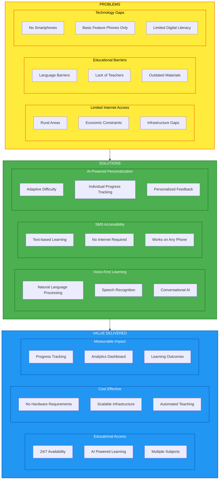
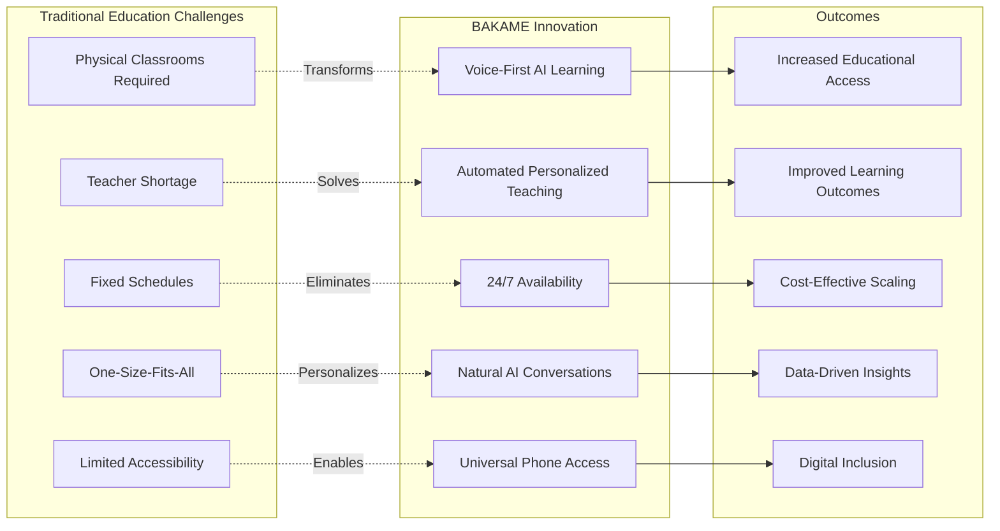
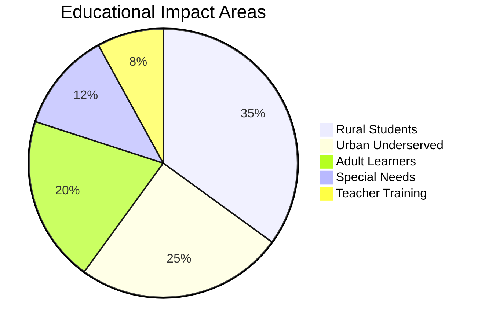
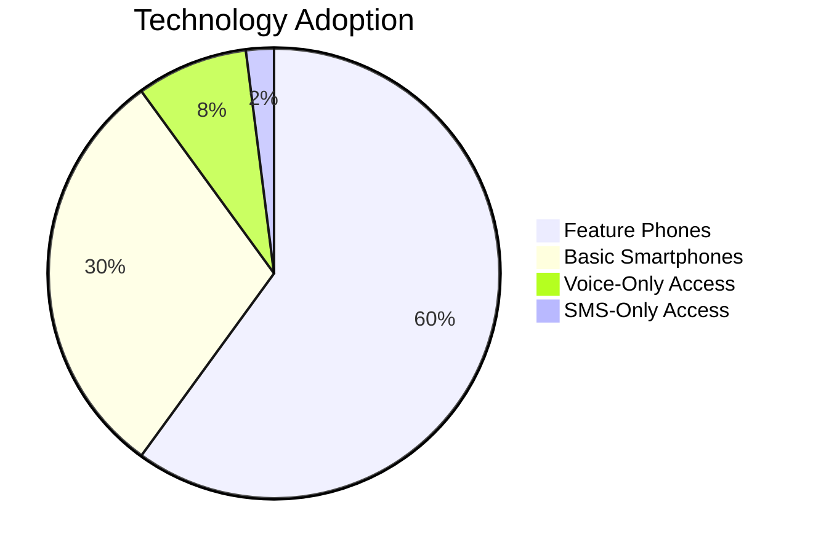
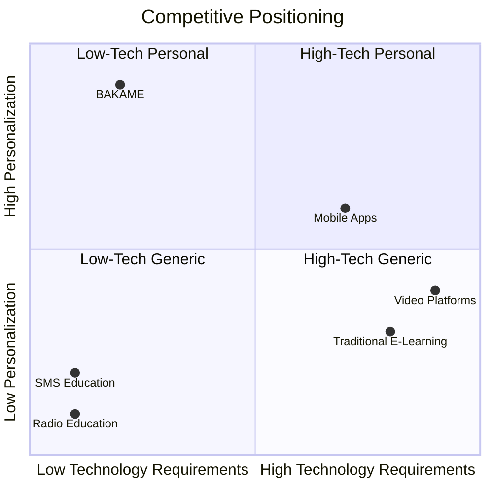

# BAKAME Value Proposition Diagram

## Problem-Solution Framework

```mermaid
flowchart TD
    subgraph Problem ["PROBLEMS" ]
        subgraph P1 ["Limited Internet Access"]
            P1A[Rural Areas]
            P1B[Economic Constraints]
            P1C[Infrastructure Gaps]
        end
        subgraph P2 ["Educational Barriers"]
            P2A[Language Barriers]
            P2B[Lack of Teachers]
            P2C[Outdated Materials]
        end
        subgraph P3 ["Technology Gaps"]
            P3A[No Smartphones]
            P3B[Basic Feature Phones Only]
            P3C[Limited Digital Literacy]
        end
    end
    
    subgraph Solution ["SOLUTIONS"]
        subgraph S1 ["Voice-First Learning"]
            S1A[Natural Language Processing]
            S1B[Speech Recognition]
            S1C[Conversational AI]
        end
        subgraph S2 ["SMS Accessibility"]
            S2A[Text-based Learning]
            S2B[No Internet Required]
            S2C[Works on Any Phone]
        end
        subgraph S3 ["AI-Powered Personalization"]
            S3A[Adaptive Difficulty]
            S3B[Individual Progress Tracking]
            S3C[Personalized Feedback]
        end
    end
    
    subgraph Value ["VALUE DELIVERED"]
        subgraph V1 ["Educational Access"]
            V1A[24/7 Availability]
            V1B[AI Powered Learning]
            V1C[Multiple Subjects]
        end
        subgraph V2 ["Cost Effective"]
            V2A[No Hardware Requirements]
            V2B[Scalable Infrastructure]
            V2C[Automated Teaching]
        end
        subgraph V3 ["Measurable Impact"]
            V3A[Progress Tracking]
            V3B[Analytics Dashboard]
            V3C[Learning Outcomes]
        end
    end
    
    Problem --> Solution
    Solution --> Value
    
    classDef problemStyle fill:#ffeb3b,stroke:#f57f17,stroke-width:2px,color:#000
    classDef solutionStyle fill:#4caf50,stroke:#2e7d32,stroke-width:2px,color:#fff
    classDef valueStyle fill:#2196f3,stroke:#1565c0,stroke-width:2px,color:#fff
    
    class Problem,P1,P2,P3 problemStyle
    class Solution,S1,S2,S3 solutionStyle
    class Value,V1,V2,V3 valueStyle
```

## Stakeholder Value Map

```mermaid
graph TB
    subgraph "Students"
        S1[Accessible Learning<br/>Any Time, Any Phone]
        S2[Personalized Education<br/>Adaptive to Skill Level]
        S3[Immediate Feedback<br/>AI-Powered Responses]
        S4[Multiple Subjects<br/>English, Math, Reading, Debate]
    end
    
    subgraph "Educators"
        E1[Teaching Analytics<br/>Student Progress Insights]
        E2[AI Support<br/>Natural Learning Conversations]
        E3[Scalable Reach<br/>Serve More Students]
        E4[Resource Efficiency<br/>Automated Instruction]
    end
    
    subgraph "Institutions"
        I1[Cost Reduction<br/>Lower Infrastructure Needs]
        I2[Wider Coverage<br/>Reach Remote Areas]
        I3[Data-Driven Decisions<br/>Learning Analytics]
        I4[Quality Assurance<br/>Consistent Education]
    end
    
    subgraph "Communities"
        C1[Educational Equity<br/>Equal Access to Learning]
        C2[Economic Development<br/>Skilled Workforce]
        C3[Digital Inclusion<br/>Technology Adoption]
        C4[Social Impact<br/>Improved Literacy Rates]
    end
    
    BAKAME[BAKAME AI Platform] --> S1
    BAKAME --> S2
    BAKAME --> S3
    BAKAME --> S4
    BAKAME --> E1
    BAKAME --> E2
    BAKAME --> E3
    BAKAME --> E4
    BAKAME --> I1
    BAKAME --> I2
    BAKAME --> I3
    BAKAME --> I4
    BAKAME --> C1
    BAKAME --> C2
    BAKAME --> C3
    BAKAME --> C4
```

## Technology Innovation Framework

```mermaid
flowchart LR
    subgraph "Traditional Education Challenges"
        T1[Physical Classrooms Required]
        T2[Teacher Shortage]
        T3[Fixed Schedules]
        T4[One-Size-Fits-All]
        T5[Limited Accessibility]
    end
    
    subgraph "BAKAME Innovation"
        B1[Voice-First AI Learning]
        B2[Automated Personalized Teaching]
        B3[24/7 Availability]
        B4[Natural AI Conversations]
        B5[Universal Phone Access]
    end
    
    subgraph "Outcomes"
        O1[Increased Educational Access]
        O2[Improved Learning Outcomes]
        O3[Cost-Effective Scaling]
        O4[Data-Driven Insights]
        O5[Digital Inclusion]
    end
    
    T1 -.->|Transforms| B1
    T2 -.->|Solves| B2
    T3 -.->|Eliminates| B3
    T4 -.->|Personalizes| B4
    T5 -.->|Enables| B5
    
    B1 --> O1
    B2 --> O2
    B3 --> O3
    B4 --> O4
    B5 --> O5
```

## Market Impact Visualization

```mermaid
pie title Educational Impact Areas
    "Rural Students" : 35
    "Urban Underserved" : 25
    "Adult Learners" : 20
    "Special Needs" : 12
    "Teacher Training" : 8
```

```mermaid
pie title Technology Adoption
    "Feature Phones" : 60
    "Basic Smartphones" : 30
    "Voice-Only Access" : 8
    "SMS-Only Access" : 2
```

## Competitive Advantage Matrix

```mermaid
quadrantChart
    title Competitive Positioning
    x-axis Low Technology Requirements --> High Technology Requirements
    y-axis Low Personalization --> High Personalization
    quadrant-1 High-Tech Personal
    quadrant-2 Low-Tech Personal
    quadrant-3 Low-Tech Generic
    quadrant-4 High-Tech Generic
    
    BAKAME: [0.2, 0.9]
    Traditional E-Learning: [0.8, 0.3]
    SMS Education: [0.1, 0.2]
    Mobile Apps: [0.7, 0.6]
    Radio Education: [0.1, 0.1]
    Video Platforms: [0.9, 0.4]
```
